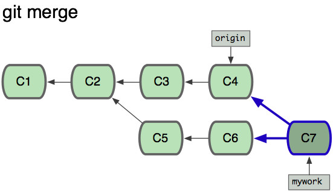

# git实践

## 工作区概念
 

## 创建版本库

### 创建git库

```
$ mkdir gitdemo && cd gitdemo
$ git init
Initialized empty Git repository in F:/gitdemo/.git/
```

通过ls -a可以看到目录下生成了.git目录。

### 添加工作文件

```
$ echo 'Hello git' > README.md
```

### 查看仓库状态

```
$ git status
On branch master

Initial commit

Untracked files:
  (use "git add <file>..." to include in what will be committed)

        README.md    # 这里是红色

nothing added to commit but untracked files present (use "git add" to track)
```

git status是个好东西，建经常执行，以保证在我们的期望状态中。

```
$ git add .
```

*这里`.`表示添加当前目录下的所有文件，包括子目录。也可以指定某特定的目录或文件。*

这时候再执行git status

```
$ git status
On branch master

Initial commit

Changes to be committed:
  (use "git rm --cached <file>..." to unstage)

        new file:   README.md   # 这里是绿色
```

### 提交修改到仓库

```
$ git commit -m 'init and add README'
```

 提交时候必须在-m参数后写入提交信息。

### 查看提交日志

```
$ git log
commit e30db62d9ab26683351e0b4d92a3ce0d56bc53fb
Author: ikaven1024 <ikaven1024@github.com>
Date:   Sun Dec 4 22:35:31 2016 +0800

    init and add README
```

还可以以图形化显示合并分支，这在后面学习分支合并时候可以看看

```
git log --pretty=format:"%h %s" --graph
```

### 比较修改

继续对文件进行修改

```
$ echo 'gitバージョンは分散制御システム' >> README.md
```

在用status看下

```
$ git status
On branch master
Changes not staged for commit:
  (use "git add <file>..." to update what will be committed)
  (use "git checkout -- <file>..." to discard changes in working directory)

        modified:   README.md  # 这里是红色

no changes added to commit (use "git add" and/or "git commit -a")
```

可以通过diff命令来查看修订

```
$ git diff
diff --git a/README.md b/README.md
index 0dec223..9aa2fc6 100644
--- a/README.md
+++ b/README.md
@@ -1 +1,2 @@
 Hello git
+gitバージョンは分散制御システム     # +表示这行是新加的
```

## 撤销回退

### 从版本库中恢复

咦，我的同事们不认识日文，赶紧用英文重新写吧。先恢复下

```
$ git checkout -- README.md
```

*同样，这里的`.`也表示目录，也可以指定文件。*

*这里也可以不加 --。但是不推荐，因为git中checkout还有切换分支的意思。如果刚好有个分支名叫README.md，那么`git checkout -- README.md`执行的是切换分支的动作。*

查看下文件是不是恢复了

```
$ cat README.md
Hello git
```

正如我们所愿。继续修改吧

```
$ echo 'Git is a distributed version control system' >> README.md
$ git add .
```

### 从暂存区恢复

继续对上面的文档进行修改：

```
$ echo 'Git is the best csv on the word!' >> README.md
```

Oh，这么写要被那帮SVNer喷了。为了世界和平，低调，还是不写吧，撤销！

```
$ git checkout -- README.md
```

*这里同样用了checkout命令，但是不尽相同。checkout先检查暂存区中是否存在文件修改，如果有则恢复为这一版本（如这节所展示）。若暂存区中不存在，则从版本库中恢复（如上节所示）*

修订完后提交吧

```
$ git add .
$ git commit -m 'add description'
```

### 版本库回退

现在我们的仓库中已经已经有了两个commit（提交记录由最新往旧地列出）：

```
$ git log
commit dd88e826a10d2d973a27e528083428af6851e6b6
Author: ikaven1024 <ikaven1024@github.com>
Date:   Sun Dec 4 22:52:30 2016 +0800

    add description

commit e30db62d9ab26683351e0b4d92a3ce0d56bc53fb
Author: ikaven1024 <ikaven1024@github.com>
Date:   Sun Dec 4 22:35:31 2016 +0800

    init and add README
```

某天，我们想吧仓库回退到前一commit，需要用reset命令。

```
$ git reset HEAD^
```

*HEAD表示当前最新的commit，^表示往前一个分支，可以有多个^，表示往前面回退多个版本。也可以用`HEAD~<n>`，<n>表示回退步数。*
*另外，我们也可以直接指定回退到哪个commit id， 如*

```
$ git reset --hard e30db62d9ab26683351e0b4d92a3ce0d56bc53fb
```

*commit id 也可以是短ID，如`e30db62d`*

此时我么再log下

```
$ git log
commit e30db62d9ab26683351e0b4d92a3ce0d56bc53fb
Author: ikaven1024 <ikaven1024@github.com>
Date:   Sun Dec 4 22:35:31 2016 +0800

    init and add README
```

回退成功，可以再检查下工作区。

此时我们已经看不到第二个提交了！那如果想回退到第二个提交怎么吧，commit id也找不到了！别急，可以使用reflog命令

```
$ git reflog
e30db62 HEAD@{0}: reset: moving to HEAD~1
dd88e82 HEAD@{1}: reset: moving to dd88e826a10d2d973a27e528083428af6851e6b6
e30db62 HEAD@{2}: reset: moving to e30db62d9ab26683351e0b4d92a3ce0d56bc53fb
dd88e82 HEAD@{3}: commit: add description
e30db62 HEAD@{4}: commit (initial): init and add README
```

这里记录了历史记录，可以查找到id: dd88e826a10d2d973a27e528083428af6851e6b6。恢复下

```
git reset dd88e826a10d2d973a27e528083428af6851e6b6
```

*reset重置了仓库中的指针。对于暂存区和工作区有三种模式：*

| 参数            | 暂存区  | 工作区  |
| ------------- | ---- | ---- |
| --soft        | 不恢复  | 不恢复  |
| --mixed（缺省模式） | 恢复   | 不恢复  |
| --hard        | 恢复   | 恢复   |

## 修改提交

此时你发现上次的修改中`world`拼写错了！马上进行了修改，然后准备提交。此时你再想，如果每次发现这种小错误然后单独提交，那么会不会造成commit泛滥，我们能不能把修改打入上个commit中呢？强大的git也提供了这种修复功能

```
$ git commit --ammend
```

敲完命令后进入commit编辑界面，这里还可以对commit信息进行重新编辑。修改完后保存退出，修订完毕。

*这个命令在我们的开发过程中非常有用。我们在开发分支写完代码后提交，交由reviewer审核。对审核问题的修订就可以用这种方式补交。全部修订完后再向主分支合并*

## 合并多个提交

倘若你没有按照我上面的做法来实施的，已经造成了泛滥的commit，那还能不能补救呢？也就是合并多个commit，对于这问题，git可以采用多种方法实现

#### 用reset合并

reset除了hard模式，能够修改版本库的指针，并不恢复工作区。所以我们可以用reset命令将head指针移到前面的commit，然后对工作区进行做重新的提交。这样就完成了commit的合并。

#### 用rebase合并

度娘上很多，不再累述。

## 分支管理

分支是git重要并实用特性。在实际开发中，我们往往会建立多个分支，并在分支中来回切换。一般我们都有个master分支，这分支是在git init就建立好的，我们上面的操作都是在这个分支上进行的。实际上这是一个不好的习惯。master分支应该是版本库中的稳定版本，提供对外的测试和发布。我们在开发中，会为每个特性分别建立分支，代码的编写、调试、审核都在这特性分支上。在审核通过后才允许申请合入主线分支（master分支）。

### 新建、切换分支

现假设master上已经是我们项目的主线版本了，现在要开始新的特性开发工作。首先从master上分化出一条分支feature1

```
$ git checkout -b feature1
```

还记得前面我们也用过checkout命令吗。这里就是用到了他的第二含义：切换分支。因为分支不存在，所以加上`-b`参数表面创建分支并切换到新的分支。执行命令

```
$ git branch
* feature1       # `*`指示当前分支
  master
```

*在已存在的分支中切换，就不要加-b参数了，直接`git checkout feature1`*

实际工作中，我们可能有多个分支，我们的分支应该是这样的：


### 合并分支

#### merge

 

有分叉的话，会要求提交一个 merge commit(C7)

也可以指定`--no--ff`来关闭fast-forward，每次合并都要添加一个merge commit。

#### rebase

 

不会出现分叉，也不会出现新的commit

### 解决冲突

#### merge

```
$ git merge dev
Auto-merging README.md
CONFLICT (content): Merge conflict in README.md
Automatic merge failed; fix conflicts and then commit the result.
```

```
$ cat README.md
Hello git
<<<<<<< HEAD    # 下面的内容是当当前分支的
test
=======         # 分割线
dev
>>>>>>> dev     # 上面的分支是合并分支的

```

修改完冲突后

```
$ git add.
$ git commit -m 'Merge dev'
```

#### rebase

```
$ git rebase dev
First, rewinding head to replay your work on top of it...
Applying: add test
Using index info to reconstruct a base tree...
M       README.md
Falling back to patching base and 3-way merge...
Auto-merging README.md
CONFLICT (content): Merge conflict in README.md
error: Failed to merge in the changes.
Patch failed at 0001 add test
The copy of the patch that failed is found in: .git/rebase-apply/patch

When you have resolved this problem, run "git rebase --continue".
If you prefer to skip this patch, run "git rebase --skip" instead.
To check out the original branch and stop rebasing, run "git rebase --abort".
```

解决玩冲突后

```
$ git add .
$ git rebase --continue
Applying: add test
```

### 删除分支

```
$ git branch -d dev
```

## 远程仓库

### github上新建仓库


### 添加远程仓库

格式是

```
git remote add <仓库别名> <远程地址>
```

比如

```
$ git remote add origin https://github.com/ikaven1024/gitdemo.git
```

可以通过以下方式查看关联的远程仓库

```
$ git remote -v
origin  https://github.com/ikaven1024/gitdemo.git (fetch)
origin  https://github.com/ikaven1024/gitdemo.git (push)
```

可能我们会同事有多个远程仓库，比如一个是代码的主仓库，还有是你fork出来的仓库。都可以通过以上方式添加，记得取个不一样的名称。

### 推送仓库到远程

```
$ git push -u origin master
```

其实push命令的全写应该是

```
git push [<options>] <远程仓库名> <本地分支>:<远程分支>
```

后面的分支名可以省略，但是不同的省略方式有不同的含义。

1. 省略`:<远程分支>`：推送到与本地分支关联的分支，一般为同名分支
2. 省略`<本地分支>`：删除远程仓库上的分支

参数中常用的有：

* `-u`: 将本地和远程仓库建立上下游关联，以后可以直接=使用`git pull`和`git push`而不用指定仓库
* `-f`: 强制覆盖分支

### 从远程仓库克隆到本地

```
$ git clone https://github.com/ikaven1024/gitdemo.git
```

### 推送修改到远程

```
$ git push <远程仓库名> <本地分支>:<远程分支>
```

如上所述，不再累述

### 获取远程最新版本

有两种方式
#### pull

```
$ git pull origin master     # 同时完成了更新和合并
```

同push，pull的全写是

```
git pull [<options>] <远程仓库名> <远程分支>:<本地分支>
```

省略`:<远程分支>`表示将分支更新到本地的`<远程仓库名>/<远程分支>`上。这是隐藏的分支，可以通过`git branch -a`查看到。

常用的参数有：

* `-f`：强制覆盖本地分支


* `-t`：同时更新tag

#### fetch

```
$ git fetch origin master     # 获取远程mater分支上最新版本到本地的origin/master
$ git rebase origin/master    # 合并，也可以用merge。见前面的合并分支
```

参数名称同pull。

推荐这种方式

## 其他命令

### 存储修改

我们在开发过程中，这时候发来一个紧急bug需要立马修复，而手头上的工作只做到一半，还没到提交的程度。此时我们可能需要git的stash功能，将当前修改推入git的栈中，将工作区恢复为上次的commit。

```
git stash
```

修改完毕后，恢复上次的工作

```
git statck pop
```

### cherry-pick

在一个分支上修复一个bug后，发现其他分支也有同样的问题，也需要同样的修复，这是就可以用cherry-pick来快速打补丁

```
git cherry-pick <commit-id>
```

### 逐行追溯

某天，我们在阅读代码时候，发现了一个精彩的实现，想看看是哪位大神的杰作，或者是糟糕的代码，想鄙视下哪个菜鸟。

```
git blame <文件>
```


### 标签

#### 打标签

```
$ git tag <标签名>
```

### 查标签

```
$ git tag
```

#### 签出标签

```
$ git checkout <标签名>
```


## .gitignore

https://github.com/github/gitignore

## 常用命令

常用`-h`

| git命令                            | 说明                         |
| -------------------------------- | -------------------------- |
|                                  |                            |
| git status                       | 查看状态                       |
| git add <文件、目录>                  | 将修改添加提交到暂存区                |
| git commit -m <信息>               | 提交到仓库                      |
| git diff                         | 文件逐行追溯                     |
| git branch                       | 查看分支<br/>`-a`参数：所有分支       |
| git branch -d <分支名>              | 删除分支<br/>`-D`: 强制删除        |
| git checkout [<分支>] -- <文件>...   | 检出                         |
| git checkout [<选项>] <分支>         | 切换分支<br/>`-b`: 创建并切换分支     |
| git cherry-pick                  |                            |
| git clean                        | 清除工作区未跟踪文件                 |
| git clone                        | 克隆版本库                      |
| git commit                       | 提交                         |
| git config                       | 查询和修改配置<br/>`--global`全局配置 |
| git diff                         | 差异比较                       |
| git fetch [<选项>] <远程分支>[:<本地分支>] | 获取远程版本库的提交                 |
| git init                         | 版本库初始化                     |
| git log                          | 显示提交日志                     |
| git merge <分支> -m <合并信息>         | 分支合并                       |
| git mv                           | 重命名                        |
| git pull [<选项>] <远程分支>[:<本地分支>]  | 拉远程版本库的提交                  |
| git push                         | 推送至远程版本库                   |
| git rebase                       | 分支变基                       |
| git reflog                       | 分支等引用变更记录管理                |
| git remote                       | 远程版本库管理                    |
| git reset                        | 重置改变分支“游标”指向               |
| git revert                       | 反转提交                       |
| git rm                           | 删除文件                       |
| git show <指针>                    | 显示修改内容                     |
| git stash                        | 保存和恢复进度                    |
| git status                       | 显示工作区文件状态                  |
| git tag                          | 里程碑管理                      |
| git whatchanged <指针>             | 列出修改文件                     |